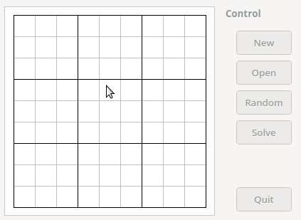

sudokurapid
===========

Sudoku solver with a fast heuristic algorithm and backtracking as a last resort.

The package comprises of three parts.

libsudokuRapid
--------------

A static library which contains the solver. Build requires *autotools*.

sudokuRapidConsole
------------------

A simple console application which can read, generate and solve *boards*.

```ShellSession
$ sudokuRapidConsole /usr/share/sudokurapid/board1.txt
Original board setup:
 - 1 3 - - - - 6 -
 - - 5 - - - 8 - 2
 - - 6 - - - - - -
 - - - - - - - 3 -
 - 3 - 7 - - - - 1
 - 5 - - 2 - - - -
 5 4 8 - 9 - - - -
 3 - - - - - - - -
 1 - - - 4 - - - -
Solved board:
 8 1 3 4 5 2 9 6 7
 9 7 5 1 3 6 8 4 2
 4 2 6 8 7 9 3 1 5
 7 8 1 9 6 5 2 3 4
 2 3 9 7 8 4 6 5 1
 6 5 4 3 2 1 7 9 8
 5 4 8 2 9 3 1 7 6
 3 6 7 5 1 8 4 2 9
 1 9 2 6 4 7 5 8 3
Number or retries: 0
```

```ShellSession
$ sudokuRapidConsole
Original board setup:
 - - - - - - - - 3
 7 - - - - - - - -
 - - 4 - - 5 - - -
 - - - - - - 3 - -
 - - - - - - 4 - 8
 - - - 3 - 1 - - -
 - - - - - - - 3 -
 - - - - - - 7 - -
 - 8 - - - - - - -
Solved board:
 5 6 8 9 1 4 2 7 3
 7 1 2 8 6 3 9 5 4
 9 3 4 2 7 5 8 1 6
 8 2 5 4 9 7 3 6 1
 3 7 1 5 2 6 4 9 8
 4 9 6 3 8 1 5 2 7
 2 5 7 6 4 8 1 3 9
 6 4 9 1 3 2 7 8 5
 1 8 3 7 5 9 6 4 2
Number or retries: 2
```

sudokuRapidQt
-------------

A simple GUI application which can read, generate and solve *boards*. Build
requires *Qt 4* or higher and *QMake*.



Building and installation
-------------------------

```ShellSession
$ ./autogen.sh
$ ./configure
$ make
$ sudo make install
```

#### ./configure options

| Option                         | Meaning                                    |
| ------------------------------ | ------------------------------------------ |
| `--help`                       | show all available options                 |
| `--disable-sudokuRapidConsole` | do not build sudokuRapidConsole            |
| `--disable-sudokuRapidQt`      | do not build sudokuRapidQt                 |
| `--disable-sudokuRapidQt-Xdg`  | do not install XDG files for sudokuRapidQt |
| `--enable-debug`               | enable printing solution stack to stdout   |

